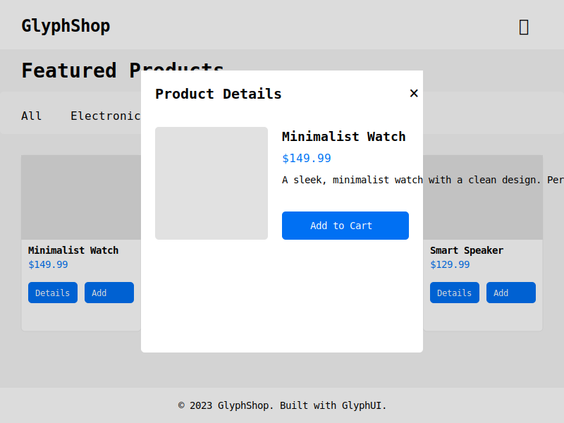

# E-Commerce Example with GlyphUI

This example demonstrates how to build a modern e-commerce application using GlyphUI. It showcases various features of the framework including components, state management, lazy loading, and slots.



## Features

-   **Product Catalog**: Display products with filtering and sorting options
-   **Shopping Cart**: Add, remove, and update quantities of items
-   **Product Details**: View detailed information about products
-   **Global State Management**: Using GlyphUI's store system
-   **Lazy Loading**: Components load on demand for better performance
-   **Responsive Design**: Works on mobile and desktop devices
-   **Modern UI**: Clean, minimal design inspired by Vercel

## Implementation Details

### State Management

The application uses GlyphUI's `createStore` and `createActions` to manage global state:

```javascript
// Create store for global state management
const useShopStore = createStore({
	cart: [],
	activeCategory: "all",
	sortOrder: "default",
	currentProductId: null,
	showCart: false,
});

// Create actions for the store
const shopActions = createActions(useShopStore, (setState, getState) => ({
	addToCart: (product) => {
		// Implementation...
	},
	// Other actions...
}));
```

### Component Architecture

The app is built with a combination of class-based components and functional components:

-   **Class Components**: For more complex components with lifecycle methods
-   **Functional Components**: For simpler, presentational components

Components are connected to the store using the `connect` function:

```javascript
// Connect ProductGrid to the store
const ConnectedProductGrid = connect(useShopStore)(ProductGrid);
```

### Lazy Loading

Product details and cart components are loaded lazily to improve initial load time:

```javascript
// Lazy load components
const ProductDetail = lazy(() => {
	return new Promise((resolve) => {
		setTimeout(() => {
			resolve(ProductDetailComponent);
		}, 500); // Simulate network delay
	});
});
```

When these components are needed, they're wrapped in a `Suspense` component to show a loading state:

```javascript
h(
	Suspense,
	{
		fallback: h("div", { class: "modal-overlay" }, [
			h("div", { class: "modal" }, [
				h("div", { class: "modal-content" }, ["Loading..."]),
			]),
		]),
	},
	[h(ConnectedProductDetail)]
);
```

### Content Projection with Slots

The Modal component uses slots to allow for flexible content:

```javascript
// Modal component for reuse
class Modal extends Component {
	render(props) {
		return h("div", { class: "modal-overlay" }, [
			h("div", { class: "modal" }, [
				h("div", { class: "modal-header" }, [
					createSlot("header", "Modal Title"),
					// Close button...
				]),
				h("div", { class: "modal-content" }, [
					createSlot("content", "Modal Content"),
				]),
			]),
		]);
	}
}

// Using the Modal with slots
return h(Modal, { onClose: shopActions.closeCart }, [
	createSlotContent("header", ["Your Cart"]),
	createSlotContent("content", [
		// Cart content...
	]),
]);
```

## Running the Example

1. Navigate to the e-commerce example directory:

    ```
    cd docs/examples/e-commerce
    ```

2. Open the `index.html` file in your browser or use a local server:
    ```
    npx http-server . -o
    ```

## Key Takeaways

This example demonstrates several important concepts:

1. **Component Composition**: Building complex UIs from smaller, reusable components
2. **State Management**: Using a centralized store for application state
3. **Lazy Loading**: Improving performance by loading components on demand
4. **Content Projection**: Using slots for flexible component design
5. **Event Handling**: Responding to user interactions
6. **Conditional Rendering**: Showing different UI based on application state

By examining this example, you can learn how to apply these concepts to your own GlyphUI applications.
